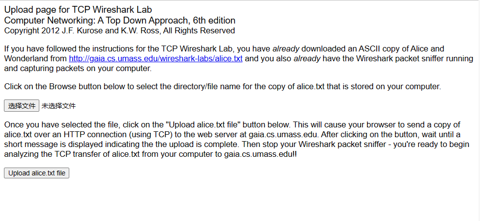
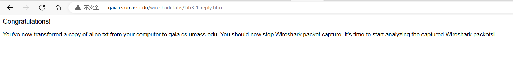
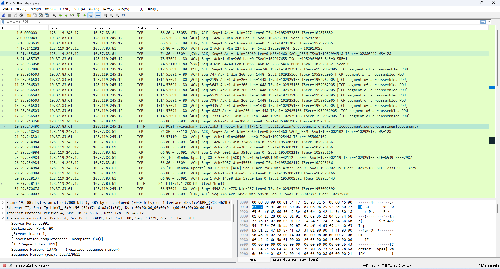
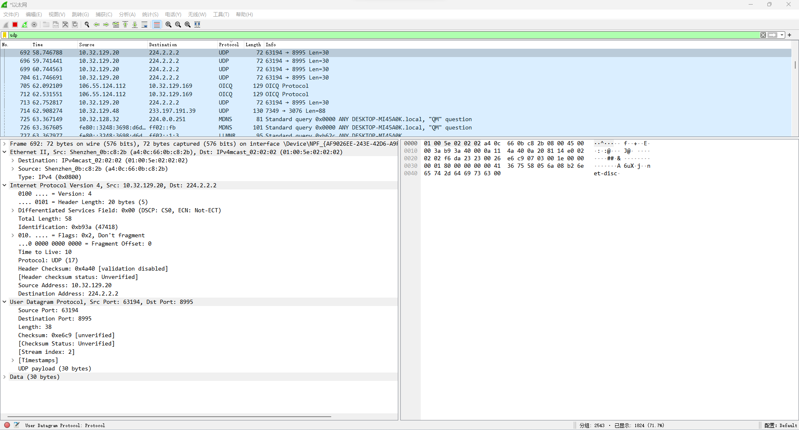

# 网络常用命令和Wireshark抓包软件的使用

### 1 实验目的

- 掌握网络常用命令的使用。 

- 学习检测本机连网的配置情况及故障分析诊断。

- 学习Wireshark软件的基本使用并进行协议分析。

### 2 实验环境

- 网络连接正常的计算机。

- Wireshark软件。

### 3 实验内容

#### 3.1 网络常用命令的使用

- 查看网络配置

1）ipconfig/all 命令：

在本机 MS-DOS 提示符下使用 ipconfig/all 命令，查看主机名、IP地址、默认网关、DNS 服务器地址。

2）arp/a 或arp -a 命令：

在本机 MS-DOS 提示符下使用 arp/a 或 arp -a 命令，查看地址解析表以检测网关及与自己主机相连接主机的 IP 和 MAC 地址。

- 检查网络连通性：ping 命令

1）ping 127.0.0.1：

在本机 MS-DOS 提示符下使用 ping 127.0.0.1 命令，查看运行结果，做简单说明。

2）ping localhost：

在本机 MS-DOS 提示符下使用 ping localhost 命令，查看运行结果，做简单说明。

3）ping 本机IP地址：

在本机 MS-DOS 提示符下使用 ping 本机IP地址 命令，查看运行结果，做简单说明。

4）ping 本机主机名：

在本机 MS-DOS 提示符下使用 ping 本机主机名 命令，查看运行结果，做简单说明。

5）ping 网关IP地址：

在本机 MS-DOS 提示符下使用 ping 网关IP地址 命令，查看运行结果，做简单说明。

6）ping www.scut.edu.cn:

在本机 MS-DOS 提示符下使用 ping www.scut.edu.cn 命令，查看运行结果，做简单说明。

- 网络协议统计：netstat 命令

1）netstat 命令

在本机 MS-DOS 提示符下输入 netstat 命令，查看本机当前激活的连接。

2）netstat -a 命令

在本机 MS-DOS 提示符下输入 netstat -a 命令，查看本机所有开放的端口号，观察结果，找出建立连接的远程 IP 和端口号。

3）netstat -es 命令

在本机 MS-DOS 提示符下输入 netstat -es 命令，查看当前局域网中的统计信息。

4）netstat -r 命令

在本机 MS-DOS 提示符下输入 netstat -r 命令，查看观察路由情况。

- 传输路径测试：tracert 命令

在本机 MS-DOS 提示符下输入 tracert www.scut.edu.cn 命令、tracert 网关 IP、tracert IP 地址，测试传输路径。

- 解析域名：nslookup 命令

在本机 MS-DOS 提示符下输入 nslookup www.scut.edu.cn 命令，执行非交互式的解析域名操作，查看解析结果；再输入 nslookup 命令后，进入交互式的解析域名操作，之后单独输入 www.scut.edu.cn 参数，查看解析结果；再输入其对应的 IP 地址，查看解析结果。退出交互输入 exit。

#### 3.2 Wireshark软件抓包

使用Wireshark软件进行抓包，并按照以下要求分别进行数据包过滤和协议分析。

- 数据包过滤

1）地址过滤

显示源IP地址和目标IP地址为本机IP地址的数据包列表。

2）端口过滤

显示源主机和目的主机TCP端口为80的数据包列表。

3）HTTP模式过滤

显示HTTP GET方法的数据包列表。

4）协议过滤

显示TCP协议和UDP协议的数据包列表。

- 协议分析

1）捕获从本地计算机到远程服务器的批量TCP传输

在开始探索TCP之前，我们需要使用Wireshark来获取“alice.txt”文件从你的计算机到远程服务器的TCP传输的数据包跟踪。你将通过访问一个网页来实现，该网页将允许你输入存储在你的计算机上的“alice.txt”文件的名称，然后使用HTTP POST方法（把大量的数据从你的计算机传输到另一台计算机）将该文件传输到一个Web服务器。在此期间我们将运行Wireshark，以获得从你的计算机发送和接收的TCP段的跟踪。具体操作步骤如下：

首先，访问http://gaia.cs.umass.edu/wireshark-labs/TCP-wireshark-file1.html ，点击“选择文件”，选择保存的“alice.txt”文件，但不点击upload按钮，不要关闭浏览器。显示如下：

 
然后，启动Wireshark并开始捕获数据。

接着，返回浏览器，点击“Upload alice.txt file”按钮来更新文件到服务器。一旦这个文件被更新，会有一条恭喜信息。显示如下：

停止Wireshark数据包捕获，此时应该显示如下内容：

用抓包结果回答下列关于TCP区段的问题：

a. 客户端（源计算机）的IP和端口号是多少？服务器的IP和端口号是多少？

b. 客户端（源计算机）和服务器之间启动TCP连接的TCP SYN区段的序列号是什么？该序列号的作用是什么？

c. 结合实例介绍“三次握手”和“四次挥手”的过程。

d. 服务器发送给客户端以回复SYN的SYNACK区段的序列号是多少？该序列号的作用是什么？

e. 包含HTTP POST命令的TCP区段的序列号是多少？

f. RTT(Round Trip Time)分析。将包含 PSH ACK 视为 TCP 连接中的第一个区段，假设第一个 Estimated RTT 的值等于第一个区段的测量 RTT，计算后续六个区段的 Estimated RTT。
（EstimatedRTT=0.875·EstimatedRTT+0.125·SampleRTT）

2）设置数据包筛选器，以便 Wireshark 仅显示在主机上发送和接收的UDP数据包。选择其中一个UDP数据包并在详细信息窗口中展开UDP字段，如下图所示。

用抓包结果回答下列关于UDP区段的问题：

a. 从你的追踪中选择一个UDP数据包，确定UDP头部有多少个字段，分别是什么？

b. 通过查询UDP数据包内容字段中显示的信息，确定每个UDP头部字段的长度（字节）。

c. Length字段由什么组成？

d. UDP有效载荷中可包含的最大字节数是多少？最大的可能源端口编号是多少？

e. UDP的协议编号是多少？用十六进制表示是什么？

f. 检查主机发送的一对UDP数据包，第二个UDP数据包是对第一个UDP数据包的回复。描述两个数据包中的端口编号之间的关系。
