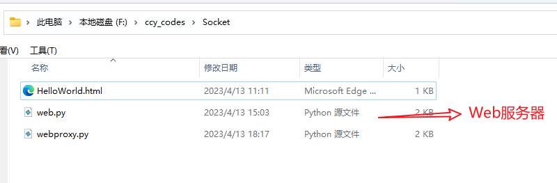
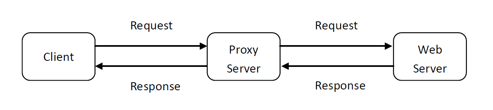
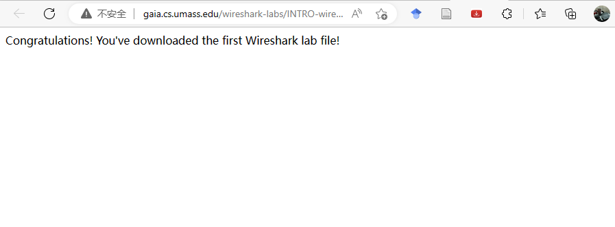
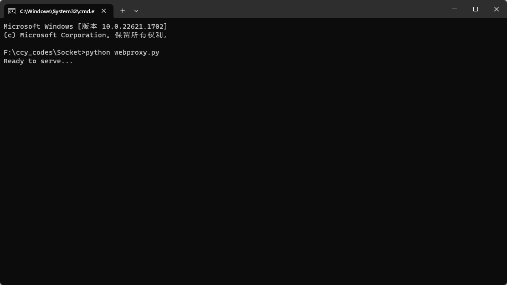
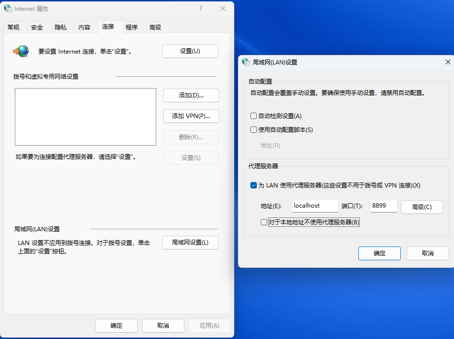
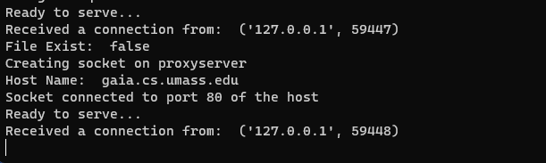
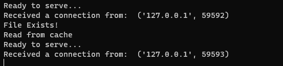

# 套接字编程——Web服务器

## Part 1：Web服务器

在本节中，您将学习Python中TCP连接的套接字编程的基础知识，包括如何创建套接字、将其绑定到指定的地址和端口，以及发送和接收HTTP数据包。这将为你打下坚实的网络编程基础，并让你能够进一步探索网络编程领域。

这不仅仅是一堆枯燥的代码。你将会开发一个真正的Web服务器，它可以处理HTTP请求。这将让你亲身体验网络通信的魅力。你的Web服务器可以接收和解析HTTP请求，然后从服务器的文件系统中获取所请求的文件，创建一个包含文件内容的HTTP响应消息，并在前面添加一行首部。最后，服务器将响应消息直接发送给客户端。如果请求的文件不存在于服务器中，那么服务器会向客户端发送一个“404 Not Found”差错报文。这将让你亲身体验网络编程中的真实问题和挑战，以及开发解决方案的创造性过程。

### 代码

下面的代码框架实现了一个简单的Web服务器。你会发现一些缺失的部分，需要填写代码来完善服务器的功能。这些部分被标注为 #Fill in start 和 #Fill in end，你需要在这里填写代码。但是，请注意，这些地方可能需要不止一行代码来完善功能。在填写代码时，请注意代码的清晰性和易读性，以便他人也能理解你的代码。

### 运行服务器

将HTML文件（例如HelloWorld.html）放在服务器所在的目录中，如图：



现在，你可以运行服务器程序并在浏览器中访问它了。确认运行服务器的主机的IP地址（例如10.37.83.61），你可以使用命令行工具或者图形界面工具来查找主机的IP地址。从另一个主机，打开浏览器并提供相应的URL。例如：

http://10.37.83.61:6789/HelloWorld.html

“HelloWorld.html”是您放在服务器目录中的文件，还要注意使用冒号后的端口号，需要使用服务器代码中使用的端口号来替换此端口号。在上面的例子中，我们使用了端口号6789. 浏览器应该显示HelloWorld.html的内容。如果省略“:6789”，浏览器将使用默认端口80，只有当您的服务器正在端口80监听时，才会从服务器获取网页。

然后用客户端尝试获取服务器上不存在的文件。你应该会得到一个“404 Not Found”消息。

### 需要上交的内容

您需要上交完整的服务器代码，以及客户端浏览器的屏幕截图，用于验证您是否从服务器实际接收到HTML文件内容。

### Web服务器的Python代码框架

```python
from socket import *
# 创建TCP套接字对象serverSocket
serverSocket = socket(AF_INET, SOCK_STREAM) 
# 将TCP套接字绑定到本地地址和指定端口6789。
# 设置最大连接数为1，开始监听客户端连接请求。
#Fill in start 
#Fill in end

while True:     
    print('Ready to serve...')
    # 接收到客户端连接请求后，建立新的TCP连接套接字connectionSocket，同时获取客户端的地址信息addr。
    connectionSocket, addr =   #Fill in start  #Fill in end
    print('Received a connection from: ', addr)
    try:
    	# 从客户端接收请求报文，提取请求的文件名，打开对应文件，并读取文件内容。
        message =   #Fill in start  #Fill in end
        filename = message.split()[1]                          
        f = open(filename[1:])
        outputdata = #Fill in start  #Fill in end
        # 构建HTTP响应头部，包括状态行和其他字段，并发送给客户端   
        #Fill in start         
        #Fill in end    

        # 逐个字符将文件内容发送给客户端。
        for i in range(0, len(outputdata)):
            connectionSocket.send(outputdata[i])
	    # 关闭与客户端的连接。
        connectionSocket.close()
    except IOError:
        # 如果请求的文件不存在，返回404错误响应。
        #Fill in start
        #Fill in end

        #Close client socket
        #Fill in start
        #Fill in end             
    serverSocket.close()
```

### 思考（可选）

1. 目前，这个Web服务器一次只处理一个HTTP请求。请实现一个能够同时处理多个请求的多线程服务器。使用线程，首先创建一个主线程，在固定端口监听客户端请求。当从客户端收到TCP连接请求时，它将通过另一个端口建立TCP连接，并在另外的单独线程中为客户端请求提供服务。这样在每个请求/响应对的独立线程中将有一个独立的TCP连接。

2. 不使用浏览器，编写自己的HTTP客户端来测试你的服务器。您的客户端将使用一个TCP连接用于连接到服务器，向服务器发送HTTP请求，并将服务器响应显示出来。您可以假定发送的HTTP请求将使用GET方法。
   客户端应使用命令行参数指定服务器IP地址或主机名，服务器正在监听的端口，以及被请求对象在服务器上的路径。以下是运行客户端的输入命令格式。 

   > client.py server_host server_port filename


## Part 2 : 多线程Web代理服务器:construction:

在本节中，您将了解Web代理服务器的工作原理及其基本功能之一 —— 缓存。

您的任务是开发一个能够缓存网页的小型Web代理服务器。这是一个很简单的代理服务器，它只能理解简单的GET请求，但能够处理各种对象 —— 不仅仅是HTML页面，还包括图片。

通常，当客户端发出一个请求时，请求将被直接发送到Web服务器。然后Web服务器处理该请求并将响应消息发送客户端。为了提高性能，我们在客户端和Web服务器之间建立一个代理服务器。现在，客户端发送的请求消息和Web服务器返回的响应消息都要经过代理服务器。换句话说，客户端通过代理服务器请求对象。代理服务器将客户端的请求转发到Web服务器。然后，Web服务器将生成响应消息并将其传递给代理服务器，代理服务器又将其发送给客户端。如图所示：



### 代码

您将在下面找到客户端的代码框架。 您需要完成代码框架。需要您填写代码的地方标有`#Fill in start`和`#Fill in end`。 每个地方都需要填写至少一行代码。

### 代理服务器的Python代码框架

该代码实现了一个简单的代理服务器，当客户端发送HTTP请求时，服务器首先检查缓存中是否存在请求的文件，如果存在则直接返回缓存中的文件内容，如果不存在则将请求转发给远程服务器，获取响应后发送给客户端，并将响应内容写入缓存文件，以便下次使用。这样可以减少对远程服务器的请求次数，提高性能。同时，该代理服务器只实现了基本的功能，没有处理各种HTTP请求头部字段，也没有实现完整的缓存策略，仅供学习和演示用途。

```python
##coding:utf-8
from socket import *

# 创建TCP套接字对象tcpSerSock，并指定监听端口为8899。
tcpSerPort = 8899
tcpSerSock = socket(AF_INET, SOCK_STREAM)

# 将TCP服务器套接字绑定到本地地址和指定端口，并开始监听连接请求，最大连接数为5。
# Fill in start.
# Fill in end.

while True:
	# 打印提示信息，表示服务器已准备好接收连接，并接受客户端的连接请求，获取客户端的地址信息。
	print('Ready to serve...')
	tcpCliSock, addr = tcpSerSock.accept()
	print('Received a connection from: ', addr)
	# 从客户端接收请求报文，最大接收4096字节，并将其解码为字符串。
	message = # Fill in start. # Fill in end.
	print(message)
    
	# 从请求报文中解析出请求的文件名，将斜杠替换为下划线。
	filename = message.split()[1].partition("//")[2].replace('/', '_')
	
	fileExist = "false"
	try:
		# 尝试打开缓存中的文件，如果文件存在，则读取文件内容到outputdata列表中，并将fileExist设置为"true"，表示文件存在。
		f = open(filename, "r")
        outputdata = f.readlines()
        fileExist = "true"
        print('File Exists!')
        
		# 如果文件存在于缓存中，将文件内容逐行发送给客户端。
		for i in range(0, len(outputdata)):
            # Fill in start. # Fill in end.
        print('Read from cache')
		
	# 如果文件不存在于缓存中，执行异常处理。
	except IOError:
        print('File Exist: ', fileExist)
		if fileExist == "false":
			# 创建一个新的套接字c，用于与远程服务器通信.
            print('Creating socket on proxyserver')
			c = # Fill in start. # Fill in end.
            
            # 解析出请求的主机名。
			hostn = message.split()[1].partition("//")[2].partition("/")[0]
            print('Host Name: ', hostn)
			try:
				# 建立与远程服务器的连接
				# Fill in start.
				# Fill in end.
                print('Socket connected to port 80 of the host')
                
				# 将请求报文发送给远程服务器
				c.sendall(message.encode())
				# 接收响应
                buff = # Fill in start. # Fill in end.
                 
				# 将响应内容发送给客户端，同时将响应内容写入缓存文件。
                tcpCliSock.sendall(buff)
				tmpFile = open("./" + filename,"wb")
				# Fill in start.
				# Fill in end.
			except:
				print("Illegal request")
		else:
			# 如果文件在缓存和远程服务器上都不存在，打印提示信息表示文件未找到。
			print('File Not Found...Stupid Andy') 
	# Close the client and the server sockets
	tcpCliSock.close()
# 关闭服务器套接字，结束程序运行。
# Fill in start.
# Fill in end.
```

### 运行代理服务器

使用链接 http://gaia.cs.umass.edu/wireshark-labs/INTRO-wireshark-file1.html 测试我们的代理程序，正常打开后会出现一条欢迎语句：



接着使用命令行模式运行您的代理服务器程序：



打开Internet设置，并设置代理，指向我们自己编写的代理程序：



然后在浏览器中打开上文提到的链接，网页将正常显示。但这时代理服务器程序显示缓存中不存在该文件，转发请求并接收响应的消息。在代理服务器程序的同目录下会发现缓存的网页文件。



我们在浏览器中重新打开该链接，网页将正常显示，但是代理程序会显示缓存中已存在该网页，于是直接返回该文件。



### 要提交的内容

您需要提交提交完整的代理服务器代码和一张客户端屏幕截图，用于验证您是否确实通过代理服务器获取了网页。

### 思考（可选）

1. 目前代理服务器不能处理错误。这可能会导致一些问题，当客户端请求一个不可用的对象时，由于“404 Not Found”响应通常没有响应正文，而代理服务器会假设有正文并尝试读取它。
2. 当前代理服务器只支持HTTP GET方法。通过添加请求体来增加对POST的支持。
