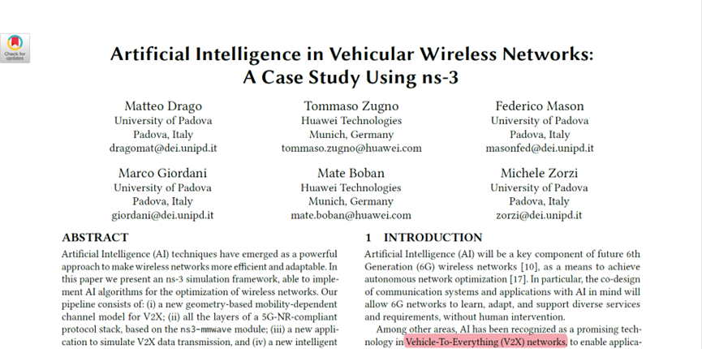
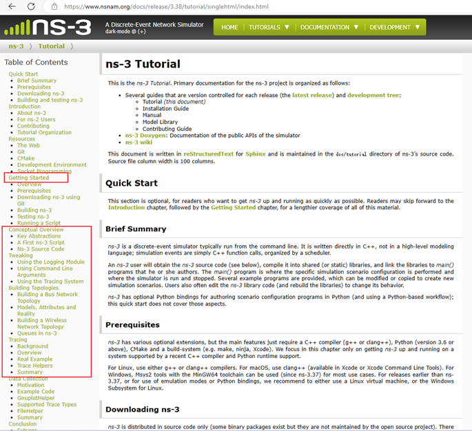
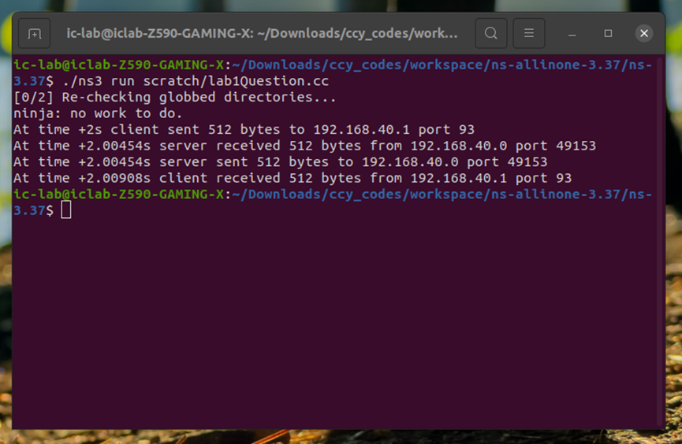
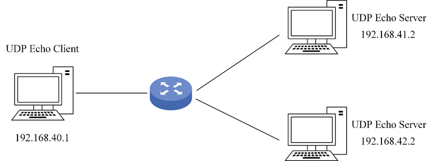

# NS-3 数据通信与简单的网络拓扑

### 1 介绍

NS-3（Network Simulator-3）是一个开源的离散事件网络模拟器，主要用于互联网系统的研究和教育。它使用C++或Python构建、在GNU GPLv2许可证下公开发布。通过NS-3，你可以创建和配置网络，以测试它们的性能，并优化它们的设计以获得最大效率。无论你是研究人员、教育工作者，还是网络爱好者，NS-3都提供了一个强大的平台来探索网络模拟和分析的复杂性。

但是，NS-3不仅仅是一个研究和教育工具，它还被广泛用于工业界，用于开发和优化无线网络算法。例如，研究人员使用NS-3模拟车辆到一切（Vehicle-To-Everything, V2X）通信网络，该网络实现了交通流控制、拥堵控制、位置跟踪和自动驾驶等应用[^1]：



在本实验中，你将学习如何在一个简答的网络拓扑结构中模拟和分析数据通讯。有了NS-3，你就有能力创建和配置网络，测试它们的性能，并优化它们的设计以获得最大的效率。

### 2 目标

本实验将重点讨论两个目标：

- 使用NS-3建立和分析一个简单的点对点链接拓扑。
- 在NS-3中使用路由构建和分析一个小型的点对点链接。

通过本教程，你将获得NS-3强大仿真工具的实践经验，并学习如何轻松地创建和分析复杂的网络拓扑结构。你将能够探索路由协议的复杂性，试验不同的网络配置，并实时分析网络的性能。对于第一个目标，我们将首先创建一个简单的点对点链接拓扑，然后分析其在不同网络条件下的性能。你将学习如何配置网络参数，模拟节点之间的数据传输，并分析网络的吞吐量、延迟和丢包。在第二个目标中，我们将深入研究NS-3的路由功能，探索如何使用路由建立一个小型的点对点链接。你将学习如何配置网络节点，设置路由协议，并分析不同条件下的网络性能指标。

### 3 实验步骤

本实验在Ubuntu 18.04 LTS发行版的Linux机器上进行（或18.04以上）。

Windows用户：Windows用户在下载ns-3之前需要安装虚拟机（如ubuntu 20.04）。

#### 3.1 安装和构建 NS-3

访问[ns-3官网](https://www.nsnam.org/)，下载最新版本的ns-3。浏览[ns-3教程](https://www.nsnam.org/docs/release/3.38/tutorial/singlehtml/index.html)第4-7章。第4章讲解下载和安装ns-3的过程。第5-7章介绍ns-3所需的基本概念。



#### 3.2 构建和使用脚本

在建立了NS-3之后，复制`examples/tutorials`中的`first.cc`文件，并将其粘贴在 `scratch`目录中。`first.cc`是一个脚本，它在两个节点之间创建一个简单的点对点链接，并在节点之间回传一个数据包。`first.cc`如下所示：

```c++
#include "ns3/applications-module.h"
#include "ns3/core-module.h"
#include "ns3/internet-module.h"
#include "ns3/network-module.h"
#include "ns3/point-to-point-module.h"

// Default Network Topology
//
//       10.1.1.0
// n0 -------------- n1
//    point-to-point
//

using namespace ns3;

NS_LOG_COMPONENT_DEFINE("FirstScriptExample");

int
main(int argc, char* argv[])
{
    CommandLine cmd(__FILE__);
    cmd.Parse(argc, argv);

    Time::SetResolution(Time::NS);
    LogComponentEnable("UdpEchoClientApplication", LOG_LEVEL_INFO);
    LogComponentEnable("UdpEchoServerApplication", LOG_LEVEL_INFO);

    NodeContainer nodes;
    nodes.Create(2);

    PointToPointHelper pointToPoint;
    pointToPoint.SetDeviceAttribute("DataRate", StringValue("5Mbps"));
    pointToPoint.SetChannelAttribute("Delay", StringValue("2ms"));

    NetDeviceContainer devices;
    devices = pointToPoint.Install(nodes);

    InternetStackHelper stack;
    stack.Install(nodes);

    Ipv4AddressHelper address;
    address.SetBase("10.1.1.0", "255.255.255.0");

    Ipv4InterfaceContainer interfaces = address.Assign(devices);

    UdpEchoServerHelper echoServer(9);

    ApplicationContainer serverApps = echoServer.Install(nodes.Get(1));
    serverApps.Start(Seconds(1.0));
    serverApps.Stop(Seconds(10.0));

    UdpEchoClientHelper echoClient(interfaces.GetAddress(1), 9);
    echoClient.SetAttribute("MaxPackets", UintegerValue(1));
    echoClient.SetAttribute("Interval", TimeValue(Seconds(1.0)));
    echoClient.SetAttribute("PacketSize", UintegerValue(1024));

    ApplicationContainer clientApps = echoClient.Install(nodes.Get(0));
    clientApps.Start(Seconds(2.0));
    clientApps.Stop(Seconds(10.0));

    Simulator::Run();
    Simulator::Destroy();
    return 0;
}
```

`first.cc`代码具体解释：


运行`first.cc`，详见：[first-ns-3-script](https://www.nsnam.org/docs/release/3.38/tutorial/singlehtml/index.html#a-first-ns-3-script).

在执行完`./ns3 --run scratch/first`后，你应该在终端看到以下输出。


`first.cc`表明客户端通过向服务器发送一个数据包来启动通信，然后服务器收到上述数据包，再向客户端发送自己的数据包，确认原始数据包被它成功接收。  

#### 3.3 实验任务1 :construction:

参考上述代码，改变数据包大小、数据率、传输延迟、节点的IP地址和服务器端口。给出实验（源码）代码和输出（图片）。如：



#### 3.4 NS-3中的简单拓扑:construction:

每当数据在计算机网络上传输时，构成数据的数据包都要经过被称为Routers的东西。这些路由器读取这些数据包上的目的地IP，并使用路由表来确定数据包到达目的地的最有效路线。我们在这个实验中要探索的正是这种Routing的现象。

在3.2节，我们在客户和服务器节点之间建立一个点对点的链接。本节中要求有一个作为路由器的中间节点的存在，有关的拓扑结构可以通过下面的图示简要地概括


我们首先创建一个单一的节点容器来容纳我们的拓扑结构所需的三个节点，然后我们将上述三个节点隔离成两个节点容器，一个用于客户端，一个用于服务器，它们之间共享路由器。 接下来是NS-3的一般程序，即指定点对点链接、安装网卡、协议栈以及在适当的节点上安装客户端和服务器应用程序。最后，加入了`Ipv4GlobalRoutingHelper::PopulateRoutingTables()`行，以允许对数据包进行路由。给出为模拟上述拓扑的行为而编写的代码，以及控制台的输出结果。


额外加分：构建如下的拓扑结构



### 参考文献

[^1]:Drago M, Zugno T, Mason F, et al. Artificial Intelligence in Vehicular Wireless Networks: A Case Study Using ns-3[C]//Proceedings of the 2022 Workshop on ns-3. 2022: 112-119.

本实验在设计过程中，内容参考了以下文档：

[虚拟机VMware下载与安装教程](https://blog.csdn.net/weixin_45912291/article/details/108894737)
[Ubuntu系统下载（清华大学开源软件镜像站）](https://blog.csdn.net/weixin_45912291/article/details/108900602)
[虚拟机VMware安装ubuntu教程](https://blog.csdn.net/weixin_45912291/article/details/108901106)
[Ubuntu20.04安装NS3](https://blog.csdn.net/qq_53273581/article/details/124848777)
